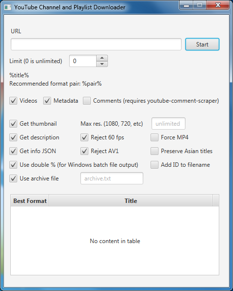

# youtubedl_java_wrapper
A YouTube scraping assistant that chooses the best format for each video on an individual basis. "Best format" means the smallest file at the highest resolution. VP9 is often smaller than MP4, but not always. You can also set a maximum resolution, in case a channel or playlist looks best at (for example) 480p but offers up to 1080p.



#### How to use

Make sure youtube-dl is somewhere in your PATH.

I recommend running this in NetBeans so you can easily copy-paste the output from its console.

Right now the program is not designed to handle individual videos. To scrape a channel or playlist, paste its URL into the URL field and click Start.

Once it's done, you have a choice. You can open a window and copy-paste commands into it one at a time, or you can copy-paste the commands into a batch file. If you choose to use batch files, you'll need to use Find/Replace in a text editor to replace .%( with .%%( or it will fail.

I like to have multiple command windows, each running a subset of the commands, which creates a multi-threaded download process. To do that, copy-paste the commands into Notepad++ and split them into a few batch files in the folders you want the videos to end up in.

Sometimes YouTube will throttle the download process to less than 100 KiB/sec. In that case, just restart the command or batch file. This program generates commands that instruct youtube-dl to resume the download process without overwriting anything.

Finally, here are the commands to organize the files when the process is complete. You can put them in a batch file and run it in the download folder. Don't run this until you're done scraping or it will re-download the thumbnails and metadata if you have to resume.

```
mkdir thumbnails
mkdir metadata
move *.description metadata
move *.json metadata
move *.jpg thumbnails
```
Once this is done, I usually compress the metadata using 7-Zip with LZMA2 and delete the metadata folder. This cuts down on wasted space from having many small files on a 4K drive.

#### Settings

- Get \[thumbnail, description] self-explanatory
- Get info JSON: Downloads a JSON file with metadata such as views, likes, and dislikes.
- Max res: The highest resolution you want the program to consider. Some videos, such as TV shows, only go up to 480p but were uploaded as 1080p. You can save space by setting the highest actual resolution in this field.
- Reject 60 fps: 60 fps takes up a lot more space so you might not want it.
- Reject AV1: AV1 is the newest YouTube codec but it hasn't been optimized yet so I avoid it.
- Force MP4: (not implemented yet) This is for channels with videos mostly before 2013/2014 when VP9 was coming into wide use. In these cases it would be better to download the videos as MP4. Keep this unchecked if most of the videos were uploaded in 2014 or later.
- Preserve Asian titles: I added this when I had to scrape a Korean channel and the filenames were being destroyed. With the box unchecked, the program converts the titles to filenames safe for Windows using a method similar to what 4K Video Downloader uses. With this box checked, it will allow youtube-dl to convert the titles to filenames, preserving Asian characters.

#### Known Issues

- "Force MP4" doesn't do anything yet
- The table at the bottom is not used at the moment. All output is sent to stdout (the command window)
- Some channels and playlists don't work. This happens often with little-known channels. This program depends on reported file sizes and for some reason youtube-dl can't provide that for some videos. In this case it may recommend two audio formats instead of video and audio. As long as it doesn't say something like "-f 139+140" it should be fine. If it does, you'll have to decide on your own if you want MP4 or VP9 and edit the command to match your choice.
- This program has trouble with certain playlists that contain private videos in the middle of the list.


#### Building

This project was built with NetBeans IDE 4.2.
